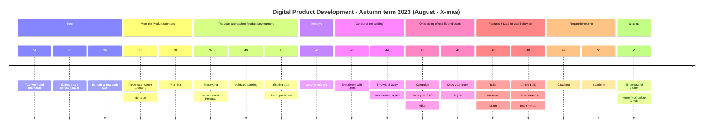
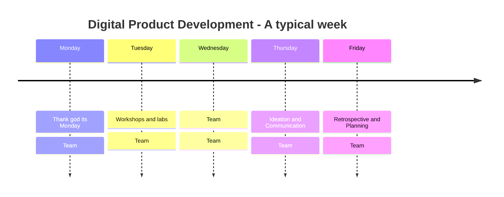

# KEA - Digital Product Deveoplemnt

##### [kea-dpd @ GitHub](https://github.com/kea-dpd) is the offical home of the the full-semester (30 ECTS) elective programme _Digital Prodcut Development_ at [Copenhagen School of Technology and Design](https://www.kea.dk) 

## First run

This international elective programme will run for the first time from August 2023 - to X-mas 2023.

##  Details

<b>Prelimiary semester plan</b> (click to expand)

---

#### Intro
Students come from all over the world to participate in this elective. Many of you are in Copenhagen for the fist time. During the intro the class is _storming._ We will familiarize you to topics like _kanban project planning_, _ideration_, _team-canvas_, _Software as a Service charactaristics_, _Design Thinking_ The last week of the intro period will be a full week of workshops on various No-code and Low-code tools which you will later exploit to develop your products.

#### Meet the product sponsors
The products you will be creating are different for each group. The problems that needs solving will derive from real-life external product sponsors, who will come and introduce their challenges, ideas and wishes. the teams are _forming_. Each team will have at least two members from each of the three domain disiplines: _Business development_, _UX and design_ and _software development_. You will work with the product sponsors to iderate, innovate and plan the actual prodcuts

#### The Startup Way
Taking off-set in the lean startup approach; _The Startup Way_ the teams will get started on pretotypes, Minimum Viable Prodcuts (MVP), combined with ideration and design thinking loops. Training for very (extremely) short loops of validated data-driven learning loops with focus on creating end-user segmentation and market-fit value.

#### Autumn Holiday
All of week 42 the school officially has vacation. But the Schoole is open, and your team will organize yourself as you want. But be sure to take it easy.

#### GOOB: _"Get out of the building"_
Intentions are fine, but nothing beats getting out of the building and facing real life. It's time for you ideas, pretotypes, mockups and MVPs to entounter the real world. 

> _"No plan survives first contact with the enemy"_

Quote: Helmuth von Molthe 

You'll encounter real-live and make necessary adjustments, preparing for.

#### Onboarding of real-life end-users
At this time you may already have had test or beta users on your prodcut but now it's time to initiate an actual onboardin campaign retting ready to take actual measures and elicit data.

#### Features & Data on user behaviour
During two intense weeks you'll enter into more validated learning loops, exploiting all the data you can elicit to measure on end-user behaviour and adjust your product to an even better market-fit.

#### Prepare for examn
Foot off the speeder. It's time to wrap up your learnings and prepare yourself for the examn. You may still have (some) time on the side to continue validated learning loops on your product though.

#### Examn
We will be running an intense semester - allowing us to finish the examn and officialy end the term before X-mas so all international students can return home for the holidays.

---

<b>Organization</b> (click to expand)

---
#### A co-workspace dedicated to just us
We will have a classroom dedicated only to this elective. It will be available and accessible around the clock thoroughout the entire semester. It will be like a joint co-workspace. So you are encourgaed to spend time here, when you are not out an about getting feedback for endusers or product sponsors. So that the entire class can benfit from each other's synergies and enthusiasm.

#### We are three main instructors:

- [Ida](https://www.linkedin.com/in/idawinberghemmingsen/) (Multi media design)
- [Mikkel](https://www.linkedin.com/in/mikkel-wessel-nielsen/) (Business economics and IT) 
- [Lars](https://www.linkedin.com/in/lakruzz/) (Computer science)
- [Herman](https://www.linkedin.com/in/hermanbailey/) (Multi media design)

...besides us, we will pull in more resources as we need them.

#### Bringing order to chaos (what does a typical week looke like?)

You will be working a lot in the individual teams, occasionally together with your external product sponsors and product end-users. but (at least) on three occasions each week during the semester will will gather the entire class.

#### Thank god its Monday
Is equvivalent to Google's renowned  _Thank god it's Friday - it's an all hands-on-deck session Where we will motivate each others, share thoughts. Get the week started with a boost. One of us will be there from morning to lunch to facilitate.

#### Workshops and labs
As we work our way into the products it will become clear that new knowledge must be obtained, new tech stacks must be concured, new tools must be learned, more theory must be chrunched. We will offer a new workshop on something relevant each wednesday from morning until lunch. Topics will be - whatever is needed in the context.

#### Ideation and Communication
On Thursdays you will write-up a formal status to your product spoonsor (and your own portfolio) and spend some time thinking out of the box - what are your options from here? One of us will be there from morning to lunch to facilitate.

#### Retrospective and Planning
Each Friday you will conduct an  internal team retrospective to discuss and maybe adjust your roles in the team and then you will need to look ahead into the upcomming week. Go through your backlog, priritize your tasks. One of us will be with your from morning until lunch to facilitate this endeavour and to guide you if you have questions.

#### Team: Fill in the blanks
The Team spots are blank spots. In a typical week this is where the team will focus on team stuff. But it doesn't mean that you are on your own. Each team will be given a pile of jetons at the begining of the semester, which can be traded in for guidance, coaching, mentoring and facilitations as you need it. We will make our calendars available to you, so you can book us in our availabel time slots.

#### "Intro" and "Meet the sponsors" are different
The first two sections of the semester are not typical weeks; in the first 3 intro weeks we will work a different program. And the two weeks set aside to iderate and innovate with the product sponsors will also be slightly different.

---

<b>Teams and roles</b>

---
As participants at this elective you will work in team of at least six people. You will assume dedicated roles of proffesion, and each team vill have two team members in each role so you can spare and cover for each other.

#### Business Developers
Will be responsible for covering knowledge, skills and compentencies regarding how to uncover and adjust the market fit of the product. Engage with the intented end-users, customer segmentation, overall planning. 

#### UX'er and marketeer
Will be responsible for covering knowledge, skills and compentencies regarding how to elicit data on the user experience, create delicious products that impress and delight, make onboarding easy and painless.

#### Technologists
Will be responsible for covering knowledge, skills and compentencies on how to choose the right tool stack, explore technology oppotunities, utilising as mush technology as effortless as possible.

#### T-Shaped people
With the roles described above, it's important to emphasize that you work as a team, and ideally you are all contributing to all areas - you will become _T-shaped;_ at the same time representing both broad knowledge, and yet specialized in certain fields. This is how a team covers most ground.

You will be working intensely low-code and no-code tools simply to speed things up.

---

<b>Didactic approach</b> (click to expand)

---
Our didactic focus throughtout this elective will be inspired by forming a _Community of Practice_ [Lave & Wenger] and on facilitating _reflective practitioners_ [Schön]. 

These didactive disiplines support each other in the way they both argue for a contemporary alternative to the traditional _master/apprentice_ relation in whihc the learnes is expected to absorb the knowledge pored from the teacher. [Lave & Wenger] introduce a _Community of Practice_ which can allow _legitimate peripheral participation_ for all new _learnes_. While [Schön] argues for establishing a _practicum_ in which the learner can train to hear to the _situation's back-talk_ and practice _reflection on action_ as a means to obtail the proficiency that is requireed to eventually practice _reflection in action_.

In short, _"Failure is not an option - it's a prerequsite"_. Your first product will not be perfect, you will experience frustration, but you will produce something and you are guaranteed to learn a lot!

---

<b>More materials</b> (click to expand)

---
- [Official description of this elective @ kea.dk (Fall 2022 )](https://katalog.kea.dk/course/preview/5340/en-GB)
- [Fancy PDF presentaion (work in progress)](https://drive.google.com/file/d/1p-hPY27ESRevpEuU9T9lrWLXegjt8hgi/view?usp=share_link)

---

