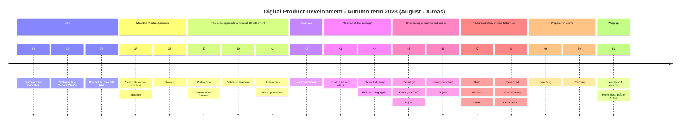

# KEA - Digital Product Deveoplemnt

##### [kea-dpd @ GitHub](https://github.com/kea-dpd) is the offical home of the the full-semester (30 ECTS) elective programme _Digital Prodcut Development_ at [Copenhagen School of Technology and Design](https://www.kea.dk) 

## First run

This international elective programme will run for the first time from August 2023 - to X-mas 2023.

<b>Preliminary semester plan</b>

---

#### Intro
Students come from all over the world to participate in this elective. Many of you are in Copenhagen for the fist time. During the intro the class is _storming._ We will familiarize you to topics like _kanban project planning_, _ideration_, _team-canvas_, _Software as a Service charactaristics_, _Design Thinking_ The last week of the intro period will be a full week of workshops on various No-code and Low-code tools which you will later exploit to develop your products.

#### Meet the product sponsors
The products you will be creating are different for each group. The problems that needs solving will derive from real-life external product sponsors, who will come and introduce their challenges, ideas and wishes. the teams are _forming_. Each team will have at least two members from each of the three domain disiplines: _Business development_, _UX and design_ and _software development_. You will work with the product sponsors to iderate, innovate and plan the actual prodcuts

#### The Startup Way
Taking off-set in the lean startup approach; _The Startup Way_ the teams will get started on pretotypes, Minimum Viable Prodcuts (MVP), combined with ideration and design thinking loops. Training for very (extremely) short loops of validated data-driven learning loops with focus on creating end-user segmentation and market-fit value.

#### Autumn Holiday
All of week 42 the school officially has vacation. But the Schoole is open, and your team will organize yourself as you want. But be sure to take it easy.

#### GOOB: _"Get out of the building"_
Intentions are fine, but nothing beats getting out of the building and facing real life. It's time for you ideas, pretotypes, mockups and MVPs to entounter the real world. 

> _"No plan survives first contact with the enemy"_

Quote: Helmuth von Molthe 

You'll encounter real-live and make necessary adjustments, preparing for.

#### Onboarding of real-life end-users
At this time you may already have had test or beta users on your prodcut but now it's time to initiate an actual onboardin campaign retting ready to take actual measures and elicit data.

#### Features & Data on user behaviour
During two intense weeks you'll enter into more validated learning loops, exploiting all the data you can elicit to measure on end-user behaviour and adjust your product to an even better market-fit.

#### Prepare for examn
Foot off the speeder. It's time to wrap up your learnings and prepare yourself for the examn. You may still have (some) time on the side to continue validated learning loops on your product though.

#### Examn
We will be running an intense semester - allowing us to finish the examn and officialy end the term before X-mas so all international students can return home for the holidays.

---

<b>Preliminary organization</b>

