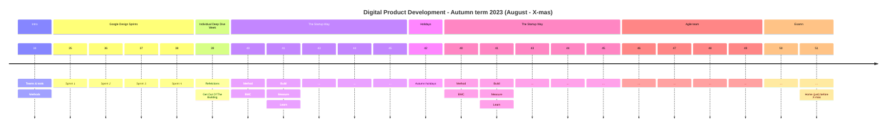

# KEA - Digital Product Deveoplemnt

##### [kea-dpd @ GitHub](https://github.com/kea-dpd) is where you get the short overview of the the full-semester (30 ECTS) elective programme _Digital Prodcut Development_ at [Copenhagen School of Technology and Design](https://www.kea.dk) 

## First run
Our international, full-semester elective “Digital Product Development” is focusing on interdisciplinary, agile teams, establishing an early contact with companies, and their end-users, exploring market fit, entering into feed-back loops, working with approaches to gain data-driven learnings. The intent is to develop digital products. This is not programming, this is product development. In this elective we will make _everyone_ developers - even the ones that are not necessarily tech saavy geeks. We do it by using relevant tools.

This international elective programme will run for the first time from August 2023 - to X-mas 2023.

<h2>Details</h2> (click to toggle expand/collapse)

### Prelimiary semester plan

#### Intro
Students come from all over the world to participate in this elective. Many of you are in Copenhagen for the fist time. During the intro the class is _storming._ We will introduce you to your lecturers, your team and familiarize you to methods and tools that you are going to learn during the semester. 
    
    

#### Google Design Sprint
The sprint is a five-day process for answering critical business questions through design, prototyping, and testing ideas with customers. Your team will get started on protoyping a digital product for an external client. You will be training for very (extremely) short loops of learning with weekly feedback from the client. You will finalize your digital product and present the final solution in the end.  

#### Deep Dive 
It's time for you to dive deep and create your individual learning goals and develop the skills you need. Furthermore this week encourage you to encounter the real world. Intentions are fine, but nothing beats getting out of the building, challenge yourself and facing real life. 

#### Autumn Holiday
All of week 42 the school officially has vacation. But the School is open, and your team will organize yourself as you want. But be sure to take it easy. Make sure to take some time off to enjoy autumn in Copenhagen. 

#### The Startup way
Taking off-set in the lean startup approach. During this theme you will be launching a new enterprise—whether it’s a tech start-up, a small business, or an initiative within a large corporation this is what you are going to do with your team. The Lean Startup is a new approach being adopted across the globe, changing the way companies are built and new products are launched. 

#### Scrum / Agile IT
Learn how to kick-start, execute, and deliver your agile projects. Combining cutting-edge tools with classic agile practices, you will learn everything you need to deliver something of value every week and make rolling your software into production.

#### Prepare for exam
Foot off the speeder. It's time to wrap up your learnings and prepare yourself for the examn. You may still have (some) time on the side to continue learning loops on your product though.

#### Exam
We will be running an intense semester - and now it is time to demonstrate how your progressed and learned during the semester. The exam will be based on your worklog, portfolio and individual reflection.

<h2>Organization</h2> (click to toggle expand/collapse)

---
#### A co-workspace dedicated to just us
We will have a classroom dedicated only to this elective. It will be available and accessible around the clock thoroughout the entire semester. It will be like a joint co-workspace. So you are encourgaed to spend time here, when you are not out an about getting feedback for endusers or your client. So that the entire class can benfit from each other's synergies and enthusiasm.

#### We are three main instructors:

- [Ida](https://www.linkedin.com/in/idawinberghemmingsen/) (Multi media design)
- [Mikkel](https://www.linkedin.com/in/mikkel-wessel-nielsen/) (Business economics and IT) 
- [Lars](https://www.linkedin.com/in/lakruzz/) (Computer science)
- [Herman](https://www.linkedin.com/in/hermanbailey/) (Multi media design)

...besides us, we will pull in more resources as we need them.

#### Learning approaches

#### Thank god its Monday
Is equvivalent to Google's renowned  _Thank god it's Friday - it's an all hands-on-deck session Where we will motivate each others, share thoughts. Get the week started with a boost.  

#### Workshops and labs
As we work our way into the products it will become clear that new knowledge must be obtained, new tech stacks must be concured, new tools must be learned, more theory must be chrunched. We will offer a new workshop on something relevant each wednesday from morning until lunch. Topics will be - whatever is needed in the context.

#### Individual reflections on learning  
You will keep a worklog and add to your prjects to your own portfolio) and you need to prioritize to spend some time thinking out of the box - what are your options from here? What are your reflection on your learnings? What are your challenges and how are you going to solve them?

#### Retrospective and Planning in teams
Each week you will conduct an internal team retrospective to discuss and maybe adjust your roles in the team and then you will need to look ahead and implement your learnings in your team. 

#### Team work: Fill in the blanks
The Team spots are blank spots. Each team will be given tools and methods on how to navigate as a strong team. Furthermore, you and your team will be given guidance, coaching, mentoring and facilitations as you need it. 

#### Working on real challenges for real clients
You and your team will be working with real clients and real challenges. You will be collaborating with selected clients in order to develop relevant digital products. 

<h2>Teams and roles</h2> (click to toggle expand/collapse)

As participants at this elective you will work in team. You will assume dedicated roles of proffesion, and each team vill have team members in each role so you can spare and cover for each other.

#### Business Developers
Will be responsible for covering knowledge, skills and compentencies regarding how to uncover and adjust the market fit of the product. Engage with the intented end-users, customer segmentation, overall planning. 

#### UX'er and marketeer
Will be responsible for covering knowledge, skills and compentencies regarding how to elicit data on the user experience, create delicious products that impress and delight, make onboarding easy and painless.

#### Technologists
Will be responsible for covering knowledge, skills and compentencies on how to choose the right tool stack, explore technology oppotunities, utilising as mush technology as effortless as possible.

#### T-Shaped people
With the roles described above, it's important to emphasize that you work as a team, and ideally you are all contributing to all areas - you will become _T-shaped;_ at the same time representing both broad knowledge, and yet specialized in certain fields. This is how a team covers most ground.

You will be working intensely with relevant tools simply to speed things up.

<h2>No-code and Low-code tools</h2> (click to toggle expand/collapse)

**Think big - Start small - Scale fast**

Our international, full-semester 30 ECTS elective “Digital Product Development” is focusing on interdisciplinary, agile teams, establishing an early contact with companies, and their end-users, exploring market fit, entering into feed-back loops, working with approaches to gain validated data-driven learnings. The intent is to develop digital products. This is not programming, this is product development. In this elective we will make _everyone_ developers - even the ones that are not necessarily tech saavy geeks. We do it by using relevant tools.

    

<h2>Didactic approach</h2> (click to toggle expand/collapse)

Our didactic focus throughtout this elective will be inspired by forming a _Community of Practice_ [Lave & Wenger] and on facilitating _reflective practitioners_ [Schön]. 

These didactive disiplines support each other in the way they both argue for a contemporary alternative to the traditional _master/apprentice_ relation in whihc the learnes is expected to absorb the knowledge pored from the teacher. [Lave & Wenger] introduce a _Community of Practice_ which can allow _legitimate peripheral participation_ for all new _learnes_. While [Schön] argues for establishing a _practicum_ in which the learner can train to hear to the _situation's back-talk_ and practice _reflection on action_ as a means to obtail the proficiency that is requireed to eventually practice _reflection in action_.

In short, _"Failure is not an option - it's a prerequsite"_. Your first product will not be perfect, you will experience frustration, but you will produce something and you are guaranteed to learn a lot!

<h2>More materials</h2> (click to toggle expand/collapse)

